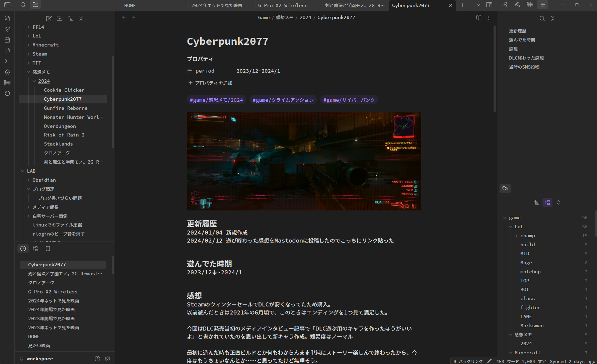

+++
author = "aries"
categories = ["diary"]
tags = ["obsidian", "メモ"]
date = 2024-06-11
title = "obsidian始めて半年経ったので振り返る"
featured = false
# featureImage = "/obsidian-window.png" # 記事トップ画像
featureImageAlt = "obsidian画面"
thumbnail = "/obsidian-window.png" # 記事リストから見えるサムネ
type = "post"
url = "posts/a199cf0e48ceaf92d393cfb725f1d584"
toc = false
usePageBundles = true
draft = false
+++

去年の年末頃にobsidianを使い始めてから半年が経った。

最初に考えてた使い方から変わっていったり、プラグイン変えてみたり、同期方法変えてみたり色々変わった。

ちょうどいいタイミングなので今の環境を振り返ってみる。

## 使わなくなったプラグイン

デイリーノート用にThino(Twitterみたいな書き方ができるプラグイン)使ったりしてましたが、今はやめました。

そもそも書くこと無いってのと、いつぞやのアップデートからThinoの画面を開くと2 Hop Links Plusが被さりデザインがぶっ壊れるようになってしまい。

この2つどちらかなら後者だよね、ってことでアンインストールしました。

それと同時にデイリーノートも使うことなくなり、たまーーーに書きどころの無い短いメモ書くのに使うくらいになりました。

そもそもPKM的な使い方がメインだから、日記とかそういうのはあんまやる気にならない。日記書いても余計に陰鬱になって死にたくなるため。

## 何を書いているか

- ゲーム関連メモ
  - 遊んだ感想、攻略系メモ
- 技術系
  - ブログ環境、Obsidian各種設定、自宅サーバー関連情報、Masotodonサーバー管理情報、今使ってるPCパーツ、ちょいちょい忘れる細かい奴(例：rloginのビープ音消し方とか)
- 生活系
  - サブスクの一覧、賃貸関連、ヘッドホンとかガジェット系
- 映画
  - 今年見た映画、見たい映画など

ゲームの感想はわりと長々書いたり書かなかったりですが、見た映画に関してはリストアップして星5でレーティングしてる程度だったりであまり一貫性無かったり。

他追加したいものとしては読んだ本の記録とかつけてもいいなーと思ってますが、実際そんなに読まないし、というのもあり悩み中。

二次創作小説は山程読んでるんですが、それらについて記録取るのもそれはそれで大変だしなーというのもあり。(ライブ更新だから書籍と違って区切りが無くて完結作品以外記録取りづらい…。エタるのがめっちゃ多いってのもあるし)

また、ファイルの分類はタグとフォルダをメインに据えていて内部リンクはほぼ使っていない状態です。

なのでリンクビューを開いてもタブが非表示だと独立した点しか無い。

## 今使っている同期方法

PC、Androidスマホ(極稀に読むくらい)、iPad mini(同じく極稀に読むくらい)の3つのデバイスを使っています。

と今書いていてあんま使ってないし同期要らなくね…とも思えてきた……。

ホントは仕事用のvaultも用意してってやりたいけど、年$50かーうーん。って感じ。(現状仕事用のメモはteamsのやりとりそれ自体がメモになってる感じで、探したいときは都度検索してる)

まぁそれはともかく、現在はRemotely SaveというプラグインとAWS S3を使っています。

暗号化もできて中々いい感じ。(selfhosted-livesyncと違って手動で同期ボタンを押して同期するのでその辺は微妙かも)

私の低頻度な同期を考えると、このくらいの方が使いやすいです。(安定してますし)

## 今使っているプラグイン

- 2Hop Links Plus
- Advanced Tables
- Banners
- Dataview
- Default New Tab Page
- Editing Toolbar
- Folder notes
- Homepage
- Open In New Tab
- Recent Files
- Remotely Save
- Settings Search
- Tag Wrangler
- TabFolder

こうして見ると使用頻度低いのもあるな……。

まぁ毎日ゴリゴリ使うってより、書きたくなったらたまに書くくらいな頻度なので(そのレベルでも、振り返るって習慣がない自分にはかなり楽しい)あまりカスタマイズとかはしてないです。

Dataviewは年次で遊んだゲームのリストアップ用(タグ付けて、それでフィルタする感じ)、その他は細かい便利系で大きく機能が変わるものでは無いです。

## 最後に

こういう生活メモがあると見た映画や買ったものを振り返るようなブログ記事なんかも書きやすいなーと画策中。

dlsiteで買ったものも振り返るべきか……？
